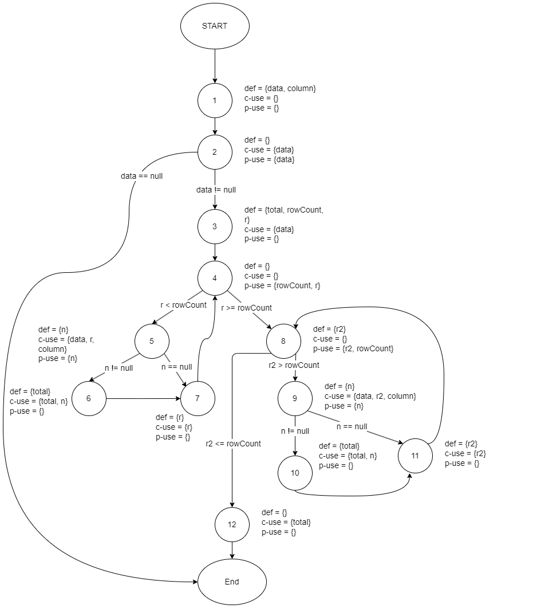
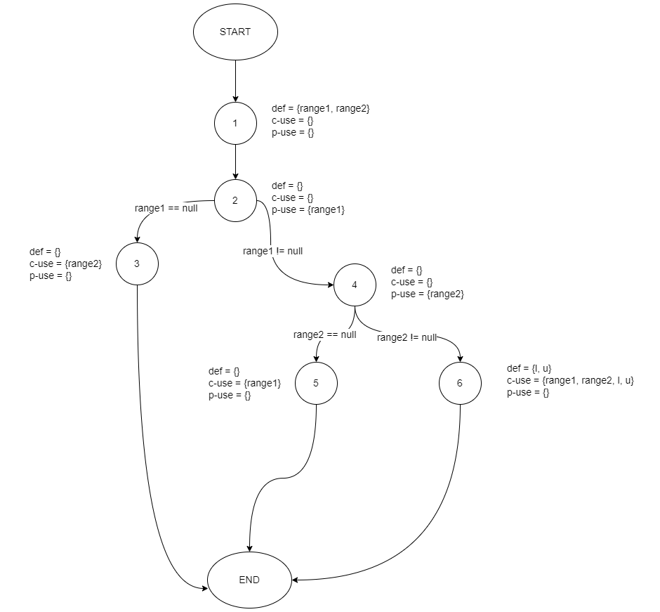

**SENG 637 - Dependability and Reliability of Software Systems**

**Lab. Report #3 – Code Coverage, Adequacy Criteria and Test Case Correlation**

| Group: 16           |
|-------------------------------|
| Sayan                     |   
| Md Afif Al               |   
| Sutirtha                   |   
| Abhijit              |
| Moshfiq-Us-Saleheen  |

(Note that some labs require individual reports while others require one report
for each group. Please see each lab document for details.)

# 1 Introduction

In this assignment 3, we will first look at different tools used to measure how well our software testing covers the code. We'll explore various tools recommended for checking these coverage measurements. Then, we will learn how to check coverage ourselves manually.

Next, we will see how to use a specific coverage tool called EclEmma. We will use it to make our test cases from Assignment 2 better.

# 2 Manual data-flow coverage calculations

### 1. `DataUtilities.calculateColumnTotal(Values2D data, int column)`
### Data flow graph


### Defs, Uses, and DU-pairs

|               |                                |
| ------------- | ------------------------------ |
| **defs**:     | def(1) = {data, column}        |
|               | def(3) = {total, rowCount, r}  |
|               | def(5) = {n}                   |
|               | def(6) = {total}               |
|               | def(7) = {r}                   |
|               | def(8) = {r2}                  |
|               | def(9) = {n}                   |
|               | def(10) = {total}              |
|               | def(11) = {r2}                 |
| **uses**:     | use(2) = {data}      |
|               | use(3) = {data}      |
|               | use(4) = {rowCount, r}      |
|               | use(5) = {data, r, column, n}              |
|               | use(6) = {total, n}              |
|               | use(7) = {r}              |
|               | use(8) = {r2, rowCount}              |
|               | use(9) = {data, r2, column, n}              |
|               | use(10) = {total, n}              |
|               | use(11) = {r2}              |
|               | use(12) = {total}              |
| **du-pairs**: | data: (1, 2), (1, 3), (1, 5), (1, 9) |
|               | column: (1, 5), (1, 9)         |
|               | total: (3, 6), (3, 10), (3, 12), (6, 6), (6, 12), (10, 10), (10, 12)         |
|               | rowCount: (3, 4), (3, 8)        |
|               | r: (3, 4), (3, 5), (3, 7), (7, 7), (7, 4)       |
|               | n: (5, 5), (5, 6), (9, 9), (9, 10)       |
|               | r2: (8, 8), (8, 9), (8, 11), (11, 11), (11, 8) |

### DU-pairs covered in test cases
| Test case | Execution path | DU-pairs covered |
|---|---|--|
|`testCalculateColumnTotalOfFirstColumn`|[1, 2, 3, 4, 5, 6, 7, 8, 12]|(1, 2), (1, 3), (1, 5), (1, 9), (3, 6), (3, 12), (6, 6), (6, 12), (3, 4), (3, 5), (3, 7), (7, 7), (7, 4), (5, 5), (5, 6), (8, 8), (8, 12)|
|`testCalculateColumnTotalOfSecondColumn`|[1, 2, 3, 4, 5, 6, 7, 8, 12]|(1, 2), (1, 3), (1, 5), (1, 9), (3, 6), (3, 12), (6, 6), (6, 12), (3, 4), (3, 5), (3, 7), (7, 7), (7, 4), (5, 5), (5, 6), (8, 8), (8, 12)|
|`testCalculateColumnTotalWhenPositiveBoundaryExists`|[1, 2, 3, 4, 5, 6, 7, 8, 12]|(1, 2), (1, 3), (1, 5), (1, 9), (3, 6), (3, 12), (6, 6), (6, 12), (3, 4), (3, 5), (3, 7), (7, 7), (7, 4), (5, 5), (5, 6), (8, 8), (8, 12)|
|`testCalculateColumnTotalWhenNegativeExists`|[1, 2, 3, 4, 5, 6, 7, 8, 12]|(1, 2), (1, 3), (1, 5), (1, 9), (3, 6), (3, 12), (6, 6), (6, 12), (3, 4), (3, 5), (3, 7), (7, 7), (7, 4), (5, 5), (5, 6), (8, 8), (8, 12)|
|`testCalculateColumnTotalWhenTheIndexBecomesTooLarge`|[1, 2, 3, 4, 5, 6, 7, 8, 12]|(1, 2), (1, 3), (1, 5), (1, 9), (3, 6), (3, 12), (6, 6), (6, 12), (3, 4), (3, 5), (3, 7), (7, 7), (7, 4), (5, 5), (5, 6), (8, 8), (8, 12)|
|`testCalculateColumnTotalWhenTheIndexBecomesTooLarge`|[1, 2, 3, 4, 5, 6, 7, 8, 12]|(1, 2), (1, 3), (1, 5), (1, 9), (3, 6), (3, 12), (6, 6), (6, 12), (3, 4), (3, 5), (3, 7), (7, 7), (7, 4), (5, 5), (5, 6), (8, 8), (8, 12)|
|`testCalculateColumnTotalAllNonNull`|[1, 2, 3, 4, 5, 6, 7, 8, 12]|(1, 2), (1, 3), (1, 5), (1, 9), (3, 6), (3, 12), (6, 6), (6, 12), (3, 4), (3, 5), (3, 7), (7, 7), (7, 4), (5, 5), (5, 6), (8, 8), (8, 12)|
|`testCalculateColumnTotalWithNulls`|[1, 2, 3, 4, 5, 6, 7, 8, 12]|(1, 2), (1, 3), (1, 5), (1, 9), (3, 6), (3, 12), (6, 6), (6, 12), (3, 4), (3, 5), (3, 7), (7, 7), (7, 4), (5, 5), (5, 6), (8, 8), (8, 12)|

### DU-pair coverage calculation per test case
| Variable (v) | Defined at node (n) | dcu(v, n) | dpu(v, n)        |
| -------- | --------------- | --------- | ---------------- |
| data     | 1               | {2, 3, 5} | {(2, 3), (2, ∅)}               |
| data     | 1               | {2, 3, 9} | {(2, 3), (2, ∅)}               |
| column   | 1               | {5}       | {}               |
| column   | 1               | {9}       | {}               |
| r        | 3               | {5, 7}    | {(4, 5), (4, 8)} |
| r        | 7               | {5, 7}    | {(4, 5), (4, 8)} |
| r2        | 8               | {9, 11}    | {(8, 9), (8, 12)} |
| r2        | 11               | {9, 11}    | {(8, 9), (8, 12)} |
| rowCount | 3               | {}        | {(4, 5), (4, 8)} |
| total    | 3               | {6, 12}    | {}               |
| total    | 6               | {6, 12}    | {}               |
| total    | 3               | {10, 12}    | {}               |
| total    | 10               | {10, 12}    | {}               |
| n        | 5               | {6}       | {(5, 6), (5, 7)} |
| n        | 9               | {10}       | {(9, 10), (9, 11)} |
|          | Total           | CU = 26   | PU = 18           |

### Findings: We have infeasible pairs which no test cases can cover!
```java
   public static double calculateColumnTotal(Values2D data, int column) {
        ParamChecks.nullNotPermitted(data, "data");
        double total = 0.0;
        int rowCount = data.getRowCount();
        for (int r = 0; r < rowCount; r++) {
            Number n = data.getValue(r, column);
            if (n != null) {
                total += n.doubleValue();
            }
        }

        // INFEASIBLE
        for (int r2 = 0; r2 > rowCount; r2++) {
            Number n = data.getValue(r2, column);
            if (n != null) {
                total += n.doubleValue();
            }
        }
        return total;
    }
```
The commented portion of the targetted method is infeasible meaning no test cases can cover this block. As we can see, when `r2 > rowCount` the loop becomes infinite. Hence, the DU-pairs from the graph connecting this block becomes infeasible.

**Infeasible pairs in the data flow graph of the method**: (8, 9), (8, 11), (11, 11), (11, 8), (9, 9), (9, 10), (10, 10), (10, 12), etc.

### 2. `Range.ccombine(Range range1, Range range2)`
### Data flow graph


### Defs, Uses, and DU-pairs

|               |                                |
| ------------- | ------------------------------ |
| **defs**:     | def(1) = {range1, range2}        |
|               | def(6) = {l, u}  |
| **uses**:     | use(2) = {range1}      |
|               | use(3) = {range2}      |
|               | use(4) = {range2}      |
|               | use(5) = {range1}              |
|               | use(6) = {range1, range2, l, u}              |
| **du-pairs**: | range1: (1, 2), (1, 5), (1, 6) |
|               | range2: (1, 3), (1, 4), (1, 6)         |
|               | l: (6, 6)         |
|               | u: (6, 6)        |

### DU-pairs covered in test cases
| Test case | Execution path | DU-pairs covered |
|---|---|--|
|`testCombineWithFirstRangeNull`|[1, 2, 3]|(1, 2), (1, 3)|
|`testCombineWithSecondRangeNull`|[1, 2, 4, 5]|(1, 2), (1, 4), (1, 5)|
|`testCombineWithValidRange`|[1, 2, 4, 6]|(1, 2), (1, 4), (1, 6), (6, 6)|
|`testCombineWithBoundaryValues`|[1, 2, 4, 6]|(1, 2), (1, 4), (1, 6), (6, 6)|
|`testCombineWithBothRangesNull`|[1, 2, 3]|(1, 2), (1, 3)|

### DU-pair coverage calculation per test case
| Variable (v) | Defined at node (n) | dcu(v, n) | dpu(v, n)        |
| -------- | --------------- | --------- | ---------------- |
| range1     | 1               | {5} | {(2, 3), (2, 4)}               |
| range1     | 1               | {6} | {(2, 3), (2, 4)}               |
| range2     | 1               | {3} | {(4, 5), (4, 6)}               |
| range2     | 1               | {6} | {(4, 5), (4, 6)}               |
| l     | 6               | {6} | {}               |
| u     | 6               | {6} | {}               |
|          | Total           | CU = 6   | PU = 8           |


# 3 A detailed description of the testing strategy for the new unit test

All the testing will be done in the JFreeChart Version 1.0.19

## Features to be tested

* org.jfree.data.DataUtilities
* org.jfree.data.Range

First, we will use a tool called [EclEmma](https://www.eclemma.org/) to check how well the test cases we made in Assignment 2 cover the code. 

## Types of Coverages
* Statement Coverage
* Branch Coverage
* Condition Coverage

```
Type of Testing: White Box Testing 
```

If the coverage for any of the ten methods is not good enough, we will examine the source code for those methods to find which parts are not tested by the current test cases.

## Minimum Coverage Conditions

* 90% statement coverage
* 70% branch coverage
* 60% condition coverage

Next, we will create new test cases to make sure we test every part of the code in each method. Lastly, we will check the coverage again with the old and new test cases to make sure it meets our required standards.

# 4 A high-level description of five selected test cases you have designed using coverage information, and how they have increased code coverage

1. `RangeTest.testIntersectsWhenContainingNegativeBoundary()`

Before adding test cases for intersects, the coverage is calculated using EclEmma as demonstrated below.

| Counter       | Coverage |
|---------------|----------|
| Insutructions | 100%     |
| Bnanches      | 87.5%    |
| Lines         | 100%     |
| Methods       | 100%     |
| Complexity    | 80%      |

With the previous approach, the main problem in the test code, we found that this condition is only covered partially.

```java
return (b0 < this.upper && b1 >= b0);
```

To improve this situation, we have added test cases `RangeTest.testIntersectsWhenContainingPositiveBoundary` and `RangeTest.testIntersectsWhenContainingNegativeBoundary` where we called the intersect method with the values of 2.0 and 4.0 and -1 and 4.0 where the first one is `b0` and the second is `b1`.

In addition to these test cases, all the matrics have coverage of 100% again, which we calculated using EclEmma.

| Counter       | Coverage |
|---------------|----------|
| Insutructions | 100%     |
| Bnanches      | 100%     |
| Lines         | 100%     |
| Methods       | 100%     |
| Complexity    | 100%     |

2. `RangeTest.testCombineWithSecondRangeNull()`

Before adding test cases for the combine, the coverage is calculated using EclEmma as demonstrated below.

| Counter       | Coverage |
|---------------|----------|
| Insutructions | 100%     |
| Bnanches      | 75%      |
| Lines         | 100%     |
| Methods       | 100%     |
| Complexity    | 60%      |

With the previous approach, the main problem in the test code, we found that this condition is only covered partially. 

```java
if (range2 == null) {
   return range1;
}
```

To improve this situation, we have added the test case `testCombineWithSecondRangeNull` where we called the combine method with the second range value as `null`.

In addition to these test cases, all the metrics have coverage of 100% again, which we calculated using EclEmma.

| Counter       | Coverage |
|---------------|----------|
| Insutructions | 100%     |
| Bnanches      | 100%     |
| Lines         | 100%     |
| Methods       | 100%     |
| Complexity    | 100%     |

3. `RangeTest.`

Before adding test cases for the equals, the coverage is calculated using EclEmma as demonstrated below.

| Counter       | Coverage |
|---------------|----------|
| Insutructions | 92.9%    |
| Bnanches      | 75%      |
| Lines         | 100%     |
| Methods       | 100%     |
| Complexity    | 60%      |

With the previous approach, the main problem in the test code, we found that this condition is only covered partially. 

```java
return (value >= this.lower && value <= this.upper);
```

To improve this situation, we have added the test case `` where we called the equals method.

In addition to these test cases, all the metrics have coverage of 100% again, which we calculated using EclEmma.

| Counter       | Coverage |
|---------------|----------|
| Insutructions | 100%     |
| Bnanches      | 100%     |
| Lines         | 100%     |
| Methods       | 100%     |
| Complexity    | 100%     |
   


# 5 A detailed report of the coverage achieved of each class and method (a screenshot from the code cover results in green and red colour would suffice)

Text…

# 6 Pros and Cons of coverage tools used and Metrics you report

In this Assignment 3, we have only used **EclEmma**.

**Pros of EclEmma:**

1. **Easy to Use:** EclEmma is user-friendly and integrates easily with Eclipse, making it simple to start with.

2. **Immediate Feedback:** It provides quick feedback on code coverage directly in the Eclipse IDE.

3. **Free and Open Source:** EclEmma is a free tool, which means anyone can use and modify it.

4. **Visual Representation:** Offers clear visual reports that show which parts of the code are covered by tests.

5. **Supports Various Coverage Types:** It measures different types of coverage, such as line, branch, and method.

**Cons of EclEmma:**

1. **Limited to Java:** EclEmma is specifically designed for Java projects, so it can't be used for other programming languages.

2. **Eclipse Dependency:** Works only within the Eclipse IDE, which can be a limitation if you use a different development environment.

3. **May Not Catch Everything:** While it measures how much code is covered, it doesn’t measure the quality of the tests.

4. **Can Encourage Overemphasis on Metrics:** Focusing too much on coverage percentages might lead to neglecting other important aspects of testing.

5. **Complex Setup for Large Projects:** Setting up EclEmma for big projects can be complicated and time-consuming.

[Coverlipse](https://coverlipse.sourceforge.net/) and [Cobertura](https://cobertura.github.io/cobertura/) had not been tested.

Thus, finally, all the test coverage was done using EclEmma.

# 7 A comparison of the advantages and disadvantages of requirements-based test generation and coverage-based test generation.

**Requirements-Based Test Generation:**

*Advantages:*

1. **Focused Testing:** Tests are created based on the specific requirements of the software, ensuring that all functionalities are checked.

2. **Clear Objectives:** Since tests are derived from requirements, it's clear what each test aims to achieve.

3. **Client Satisfaction:** Ensures the final product meets the client’s needs and requirements.

4. **Prioritization:** Helps in prioritizing testing efforts based on the importance of each requirement.

*Disadvantages:*

1. **Missed Scenarios:** Might miss testing certain parts of the code that are not covered by the requirements.

2. **Requirements Quality:** The effectiveness depends on the clarity and completeness of the requirements.

3. **Time-Consuming:** Creating tests based on requirements can be a slow process, especially for complex systems.

4. **Changes in Requirements:** Requires updates to tests whenever there are changes in the requirements, which can be frequent.

**Coverage-Based Test Generation:**

*Advantages:*

1. **Comprehensive Coverage:** Aim to cover as much code as possible, reducing the chance of missing defects.

2. **Automatic Generation:** Tools can automatically generate tests to cover code, saving time.

3. **Objective Measurement:** Provides measurable data on how much of the code is tested.

4. **Detects Dead Code:** Helps in identifying unused or unreachable code.

*Disadvantages:*

1. **Lack of Focus:** May generate tests that are less relevant to the user requirements.

2. **Overemphasis on Metrics:** Might lead to focusing too much on improving coverage numbers rather than the quality of tests.

3. **Complexity:** Generating tests based on coverage can be complex, especially for large codebases.

4. **Missing Logic:** High coverage does not guarantee that all logical paths or scenarios are tested.

# 8 A discussion on how the teamwork/effort was divided and managed

At the start, every team member set up the previous lab project on their own systems and installed all necessary dependencies. Everyone also completed an introductory part of the lab to make sure they understood enough to help with the rest of the work.

For the analysis part in section 2, we all worked together closely. We looked at the DU-pairs and DFG diagrams as a team. This helped us understand the analysis better and plan our unit tests together. After that, we all agreed on a main plan for testing in section 3.

Then, we split up to write additional test cases needed to cover the software under test (SUT), as the lab instructions said. Even though we worked individually on this, we stayed in touch to avoid doing the same work twice. After everyone finished their test cases, we brought them together. As a group, we then checked the final test coverage.

In the end, all team members contributed equally to both the lab work and writing the final report.

# 9 Any difficulties encountered, challenges overcome, and lessons learned from performing the lab

**Difficulties and Challenges:**

- Hard to update from the previous lab due to conflicting tool versions.
- Struggled with outdated and unsupported code coverage tools.
- Team collaboration was difficult with separate GitHub repositories.

**Lessons Learned:**

- Importance of organized, well-commented test suites.
- Better to organize tests into smaller, method-specific groups for easier management.

# 10 Comments/feedback on the lab itself

**Comments and Feedback:**

- This assignment was a great learning experience for understanding how to ensure our test cases are comprehensive and effectively cover the source code.
  
- It allowed us to review our previous work from Assignment 2 and evaluate our performance with black box testing techniques.

- We used EclEmma, which is conveniently available as a plugin in Eclipse, for measuring code coverage.

- The assignment instructions were detailed and clear, making them easy to understand and follow.

- The lab was well-organized and offered a solid introduction to white-box testing and code coverage. We appreciated the thorough instructions provided for setting up the testing environment.

- However, as noted, some tools used in the lab are becoming outdated. While EclEmma remains relevant and useful, a review and update of the lab's tools might be beneficial to keep up with current trends and technologies.
